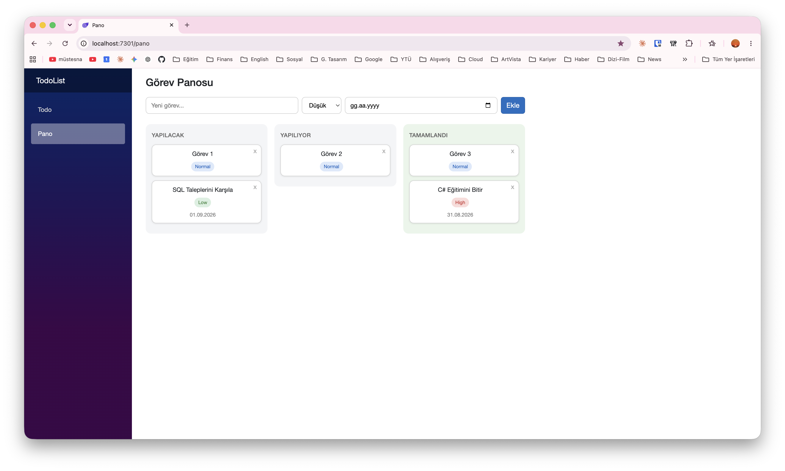

# Blazor ToDo

Blazor öğrenirken yaptığım küçük görev uygulaması. .NET 10.

- `/` — basit todo listesi
- `/pano` — sürükle-bırak kanban panosu (yapılacak / yapılıyor / tamamlandı), öncelik ve tarih

## Çalıştırma

    dotnet run
